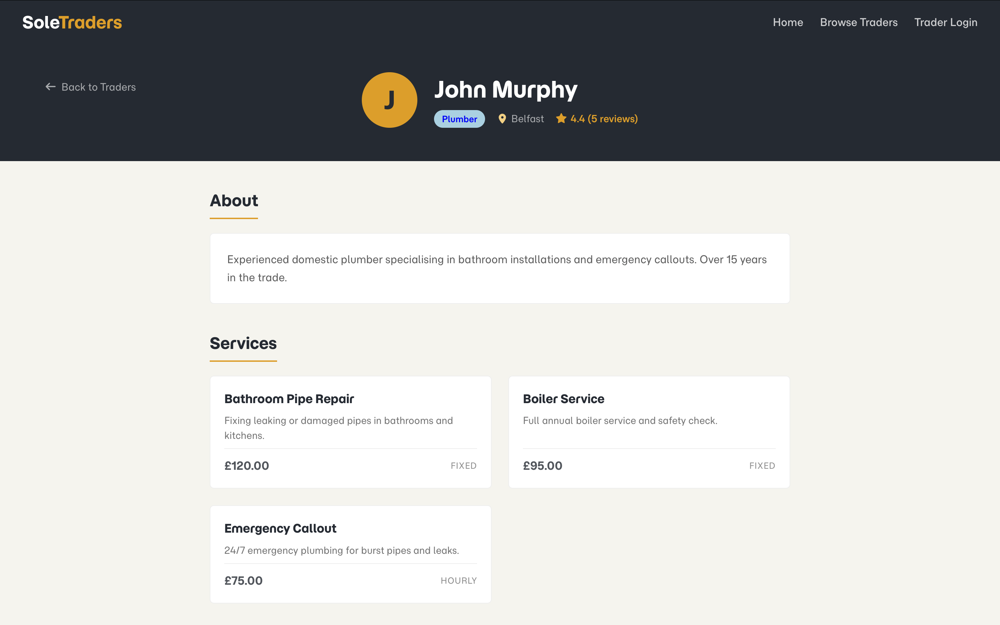
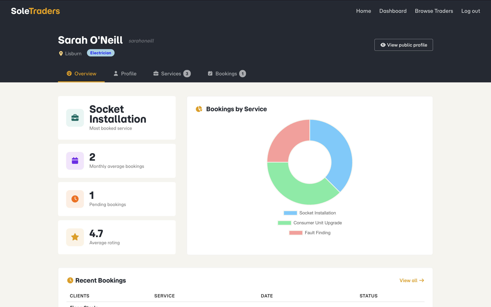

# Sole Traders

A fullstack web application connecting tradespeople with clients looking to hire their services.

Built as part of **CSC7084 Web Development** at Queen's University Belfast (2025–2026). The frontend has since been migrated to React as a personal development goal after the assessment.

---

## Overview

Sole Traders is a platform where tradespeople can register, manage their profile, list their services and handle incoming booking requests from clients. Clients can browse traders, view their profiles, submit booking requests and leave star ratings — all without needing an account.

The application runs across two independent servers:

- **API** (`port 3002`) — Node/Express REST API handling all data operations, querying the MySQL database and returning JSON
- **React Frontend** (`port 5173`) — Vite-powered React SPA consuming the REST API directly from the browser using JWT for authentication

The React frontend never interacts with the database directly. All data operations go through axios calls to the REST API, keeping database credentials isolated within the API layer.

---

## Screenshots

### Home


### Browse Traders


### Trader Profile



### Dashboard



---

## Tech Stack

| Layer          | Technology                          |
| -------------- | ----------------------------------- |
| Runtime        | Node.js                             |
| API Framework  | Express.js                          |
| Frontend       | React 19, Vite                      |
| Routing        | React Router v7                     |
| Styling        | Bulma CSS, custom CSS               |
| Database       | MySQL                               |
| Authentication | JWT (jsonwebtoken), bcrypt          |
| HTTP client    | axios                               |
| Charts         | Chart.js, react-chartjs-2           |
| Icons          | Font Awesome                        |

---

## Features

**Trader functionality:**

- Register and login with bcrypt password hashing (salt rounds: 10)
- JWT authentication — token issued on login, stored in localStorage, sent as Bearer header on protected requests
- Dashboard with tabbed navigation — Overview, Profile, Services, Bookings
- Profile management — trade type, region and bio
- Service management — add, edit and delete service listings
- Booking management — view, filter by status, accept and reject bookings
- Overview tab with Chart.js doughnut chart showing bookings by service and monthly average stat

**Client functionality:**

- Browse public trader directory with filtering by trade type and region
- View individual trader profile pages with services and reviews
- Submit booking requests without requiring an account
- Leave a star rating (1–5) for a trader

**System:**

- REST API with full CRUD operations across all entities
- JWT middleware protecting mutating and private endpoints
- Consistent JSON response structure across all endpoints
- Input validation at both client-side (HTML attributes) and server-side (API controllers)
- Input normalisation — trimming, lowercasing, title-casing, etc.
- Cascading deletes via foreign key constraints
- Performance indexes on frequently queried columns
- Responsive layout for mobile and desktop

---

## Project Structure

```
sole-traders/
├── api/
│   ├── controllers/
│   │   ├── authController.js
│   │   ├── availabilityController.js
│   │   ├── bookingController.js
│   │   ├── ratingController.js
│   │   ├── serviceController.js
│   │   └── traderController.js
│   ├── middleware/
│   │   └── auth.js
│   ├── routes/
│   │   ├── authRoutes.js
│   │   ├── availabilityRoutes.js
│   │   ├── bookingRoutes.js
│   │   ├── ratingRoutes.js
│   │   ├── serviceRoutes.js
│   │   └── traderRoutes.js
│   ├── sql/
│   │   └── sole_traders_schema.sql
│   ├── utils/
│   │   ├── dbconn.js
│   │   └── validate.js
│   ├── app.js
│   ├── config.env
│   └── server.js
└── webapp-react/
    ├── public/
    ├── src/
    │   ├── components/
    │   │   ├── dashboard/
    │   │   │   ├── DashboardHeader.jsx
    │   │   │   └── tabs/
    │   │   │       ├── BookingsTab.jsx
    │   │   │       ├── OverviewTab.jsx
    │   │   │       ├── ProfileTab.jsx
    │   │   │       └── ServicesTab.jsx
    │   │   ├── home/
    │   │   │   └── FeatureCard.jsx
    │   │   └── ui/
    │   │       ├── AuthNavbar.jsx
    │   │       ├── Footer.jsx
    │   │       ├── FullHeightLayout.jsx
    │   │       ├── MainLayout.jsx
    │   │       ├── Navbar.jsx
    │   │       └── ProtectedRoute.jsx
    │   ├── context/
    │   │   └── AuthContext.jsx
    │   ├── pages/
    │   │   ├── BrowseTradersPage.jsx
    │   │   ├── DashboardPage.jsx
    │   │   ├── HomePage.jsx
    │   │   ├── LoginPage.jsx
    │   │   ├── NotFoundPage.jsx
    │   │   ├── RegisterPage.jsx
    │   │   └── TraderProfilePage.jsx
    │   ├── styles/
    │   │   └── styles.css
    │   ├── utils/
    │   │   └── constants.js
    │   ├── App.jsx
    │   └── main.jsx
    ├── index.html
    └── vite.config.js
```

---

## Prerequisites

- Node.js 18+
- MySQL (via XAMPP or any MySQL server)
- npm

---

## Setup

**1. Clone the repo**

```bash
git clone https://github.com/estibenjack/sole-traders.git
cd sole-traders
```

**2. Set up the database**

Open MySQL and run the schema file:

```
api/sql/sole_traders_schema.sql
```

This will create the `sole_traders` database, all tables and populate them with seed data.

**3. Create `config.env` in `/api`**

```
PORT=3002
DB_HOST=localhost
DB_USER=root
DB_PASS=
DB_NAME=sole_traders
JWT_SECRET=your-long-random-secret-here
```

**4. Install dependencies**

```bash
cd api && npm install
cd ../webapp-react && npm install
```

---

## Running the App

Open two separate terminals:

```bash
# Terminal 1 - API
cd api && npm start

# Terminal 2 - React frontend
cd webapp-react && npm run dev
```

Then visit **http://localhost:5173**

---

## REST API Endpoints

All endpoints return JSON with a consistent `status` and `result` or `message` field. Endpoints marked 🔒 require a valid `Authorization: Bearer <token>` header.

| Method | Endpoint                    | Auth | Description                                    |
| ------ | --------------------------- | ---- | ---------------------------------------------- |
| POST   | /register                   |      | Register a new trader                          |
| POST   | /login                      |      | Authenticate a trader, returns JWT             |
| GET    | /traders                    |      | Get all traders                                |
| GET    | /traders/:id                |      | Get a single trader (public)                   |
| GET    | /traders/:id/private        | 🔒   | Get a single trader (includes email, username) |
| PUT    | /traders/:id                | 🔒   | Update a trader's profile                      |
| DELETE | /traders/:id                | 🔒   | Delete a trader                                |
| GET    | /services                   |      | Get all services                               |
| GET    | /services/:id               |      | Get a single service                           |
| GET    | /services/trader/:id        |      | Get all services for a trader                  |
| POST   | /services                   | 🔒   | Add a new service                              |
| PUT    | /services/:id               | 🔒   | Update a service                               |
| DELETE | /services/:id               | 🔒   | Delete a service                               |
| GET    | /bookings/:id               | 🔒   | Get a single booking                           |
| GET    | /bookings/trader/:id        | 🔒   | Get all bookings for a trader                  |
| GET    | /bookings/trader/:id/stats  | 🔒   | Get booking stats for a trader                 |
| POST   | /bookings                   |      | Submit a booking request                       |
| PUT    | /bookings/:id/status        | 🔒   | Accept or reject a booking                     |
| GET    | /ratings/trader/:id         |      | Get all ratings for a trader                   |
| GET    | /ratings/trader/:id/average |      | Get a trader's average rating                  |
| GET    | /ratings/averages           |      | Get average ratings for all traders            |
| POST   | /ratings                    |      | Submit a rating                                |
| GET    | /availability/trader/:id    |      | Get availability for a trader                  |

---

## Seed Data

The schema file includes seed data for 8 traders, each with services, bookings across multiple months and ratings. All seed trader passwords are bcrypt hashes of `password123`.

You can log in as any seed trader using their username (e.g. `johnmurphy`) and the password `password123`.

---

## Planned Improvements

- [ ] Trader availability timeslot generation
- [ ] Overlapping booking detection
- [ ] Password change functionality
- [ ] Trader profile photos
- [ ] Pagination on bookings and trader directory
